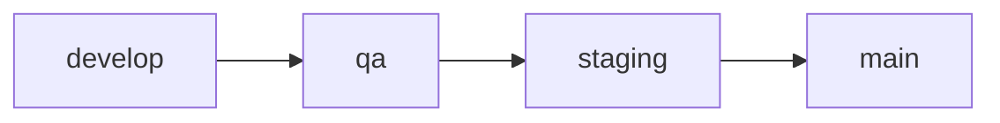

# Contentful Migrations Project

A robust content model migration system for Contentful with strict environment promotion flow and validation.

## Environment Structure

The project implements a secure content management system with four environments and a strict unidirectional promotion flow:



### Environment Mapping

This project maps GitHub environment names to Contentful environment names:

| GitHub Environment | Contentful Environment | Next Environment |
|-------------------|----------------------|-----------------|
| develop           | development         | qa             |
| qa                | qa                  | staging        |
| staging           | stage              | main           |
| main              | master             | -              |

The system automatically determines the target environment based on the promotion flow. For example, when you specify `develop` as the source environment, the system automatically knows that `qa` is the target environment.

### Promotion Rules
- Changes must follow the strict promotion flow
- Direct promotions to non-adjacent environments are not allowed
- Each promotion requires validation and approval
- Target environments are automatically determined based on the source environment

## Setup

1. Install dependencies:
```bash
npm install
```

2. Install Contentful CLI globally:
```bash
npm install -g contentful-cli
```

3. Authenticate with Contentful:
```bash
contentful login
```

4. Create a `.env` file in the root directory with your Contentful credentials:
```
CONTENTFUL_SPACE_ID=your_space_id_here
CONTENTFUL_MANAGEMENT_TOKEN=your_management_token_here
FORCE_MIGRATION=false  # Optional: allows forcing migrations in non-development environments
```

To obtain these credentials:
- Space ID: Find it in your Contentful space settings
- Management Token: Generate from Contentful > Settings > API Keys > Content management tokens

## Project Structure

```
.
├── migrations/           # Migration scripts
├── src/
│   ├── validate-migration.js    # Environment validation logic
│   ├── migrate.js              # Migration executor
│   ├── generate-migration.js    # Automatic migration generator
│   ├── sync-environments.js     # Environment synchronization tool
│   └── utils/
│       └── environment-mapper.js # GitHub to Contentful environment mapping
├── package.json
└── .env                # Environment configuration (create this file - not included in repo)
```

## Available Commands

### Check Environment Differences
```bash
# Check differences with next environment in the promotion flow
npm run check:dev      # Check differences between develop and qa
npm run check:qa       # Check differences between qa and staging
npm run check:staging  # Check differences between staging and main

# Preview synchronization (dry-run)
npm run sync:preview -- develop  # Preview changes that would be applied to qa
```

### Synchronize Environments
```bash
# Sync to the next environment in the promotion flow
npm run sync:dev      # Sync from develop to qa
npm run sync:qa       # Sync from qa to staging
npm run sync:staging  # Sync from staging to main
```

### Custom Synchronization
```bash
# Sync to the next environment (target is determined automatically)
npm run sync -- develop

# Or explicitly specify both environments (optional)
npm run sync -- develop qa
```

## Validation System

The project includes a robust validation system that ensures:

1. **Environment Flow**
   - Enforces the correct promotion path (develop → qa → staging → main)
   - Prevents invalid environment promotions
   - Validates environment access permissions
   - Automatically determines target environments

2. **File Validation**
   - Validates migration file formats
   - Ensures correct timestamp ordering
   - Verifies migration script syntax

3. **Access Control**
   - Validates Contentful credentials
   - Checks environment permissions
   - Ensures proper authentication

## CI/CD Integration

The project includes GitHub Actions workflows that:
- Validate migrations on Pull Requests
- Enforce environment promotion rules
- Automatically generate deployment tags
- Require approvals for specific environment promotions

## Recommended Workflow

1. **Check Differences**
```bash
npm run check:dev  # Will check differences with qa
```

2. **Preview Changes**
```bash
npm run sync:preview -- develop  # Will preview changes for qa
```

3. **Apply Changes**
```bash
npm run sync:dev  # Will sync to qa
```

4. **Validate Results**
   - Review the changes in the target environment
   - Check for any warnings or errors
   - Verify content model updates

## Important Notes

- ⚠️ **ALWAYS** follow the promotion flow
- Environment validation prevents invalid promotions
- Each synchronization creates a timestamped migration file
- The system includes deployment tracking via tags
- All operations support dry-run mode for safety
- Target environments are automatically determined based on the promotion flow

## Troubleshooting

If you encounter issues:

1. Verify your `.env` configuration
2. Ensure you're authenticated with Contentful CLI
3. Check environment permissions
4. Review migration logs in the console
5. Use dry-run mode to preview changes

## Security Considerations

- Never commit the `.env` file
- Keep your management tokens secure
- Use environment-specific access tokens
- Follow the principle of least privilege
- Regularly rotate access tokens

# Contentful Migration Action

A GitHub Action for managing Contentful content model migrations between environments.

## Features

- Automated content model migrations between Contentful environments
- Preview changes before applying
- Automatic PR comments with migration details
- Validation of environment configurations
- Support for dry-run mode
- Automatic deployment tagging
- Automatic target environment determination

## Usage

### Basic Example

```yaml
name: Contentful Migration

on:
  pull_request:
    paths:
      - 'migrations/**'
  workflow_dispatch:
    inputs:
      source_environment:
        description: 'Source environment'
        required: true
        type: choice
        options:
          - develop
          - qa
          - staging

jobs:
  migrate:
    runs-on: ubuntu-latest
    steps:
      - uses: your-org/contentful-migrations-project/.github/workflows/contentful-migration@v1
        with:
          space-id: ${{ secrets.CONTENTFUL_SPACE_ID }}
          management-token: ${{ secrets.CONTENTFUL_MANAGEMENT_TOKEN }}
          source-environment: ${{ github.event.inputs.source_environment || 'develop' }}
          dry-run: ${{ github.event_name == 'pull_request' }}
```

### Advanced Example with Environment Promotion

```yaml
name: Contentful Environment Promotion

on:
  workflow_dispatch:
    inputs:
      source_environment:
        description: 'Source environment'
        required: true
        type: choice
        options:
          - develop
          - qa
          - staging
      dry_run:
        description: 'Dry run (no changes applied)'
        type: boolean
        default: true

jobs:
  migrate:
    runs-on: ubuntu-latest
    steps:
      - uses: your-org/contentful-migrations-project/.github/workflows/contentful-migration@v1
        with:
          space-id: ${{ secrets.CONTENTFUL_SPACE_ID }}
          management-token: ${{ secrets.CONTENTFUL_MANAGEMENT_TOKEN }}
          source-environment: ${{ github.event.inputs.source_environment }}
          dry-run: ${{ github.event.inputs.dry_run }}
```

## Inputs

| Input | Description | Required | Default |
|-------|-------------|----------|---------|
| `space-id` | Contentful Space ID | Yes | - |
| `management-token` | Contentful Management Token | Yes | - |
| `source-environment` | Source environment ID (GitHub environment name: develop, qa, staging) | Yes | - |
| `node-version` | Node.js version to use | No | '20.19.0' |
| `dry-run` | Whether to perform a dry run | No | 'true' |
| `github-token` | GitHub token for PR comments | No | ${{ github.token }} |

## Outputs

| Output | Description |
|--------|-------------|
| `migration-status` | Status of the migration (success/failure) |
| `changes-detected` | Whether changes were detected between environments |
| `migration-summary` | Summary of the migration changes |

## Security

- Store your Contentful tokens as GitHub Secrets
- Use environment protection rules for production environments
- Enable required reviewers for migrations to production
- Always use dry-run mode in pull requests

## Best Practices

1. **Environment Flow**
   - develop → qa → staging → main
   - Never skip environments in the promotion chain
   - Let the system determine the target environment automatically

2. **Pull Requests**
   - Always create a PR for migrations
   - Review the preview changes carefully
   - Use dry-run mode before applying changes

3. **Validation**
   - Validate your migrations before applying
   - Check for breaking changes
   - Test in lower environments first

## Troubleshooting

### Common Issues

1. **Authentication Errors**
   - Verify your Contentful tokens
   - Check token permissions
   - Ensure tokens are properly set in secrets

2. **Migration Failures**
   - Check the migration preview
   - Verify environment access
   - Review migration logs

3. **PR Comments Not Working**
   - Verify GitHub token permissions
   - Check if the PR is from a fork
   - Ensure the action has write permissions

### Getting Help

- Open an issue in the repository
- Check the Contentful migration documentation
- Review the action logs for detailed error messages 